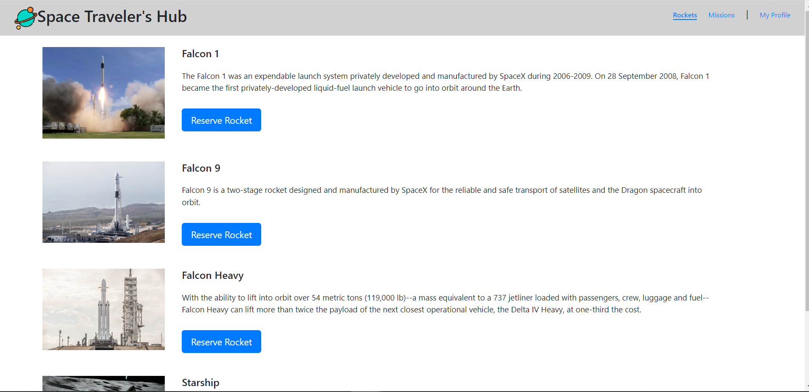
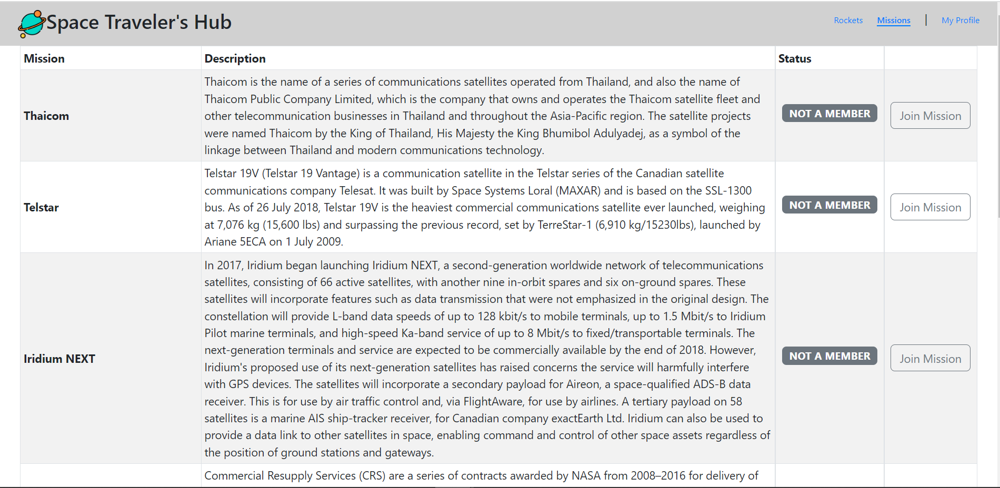
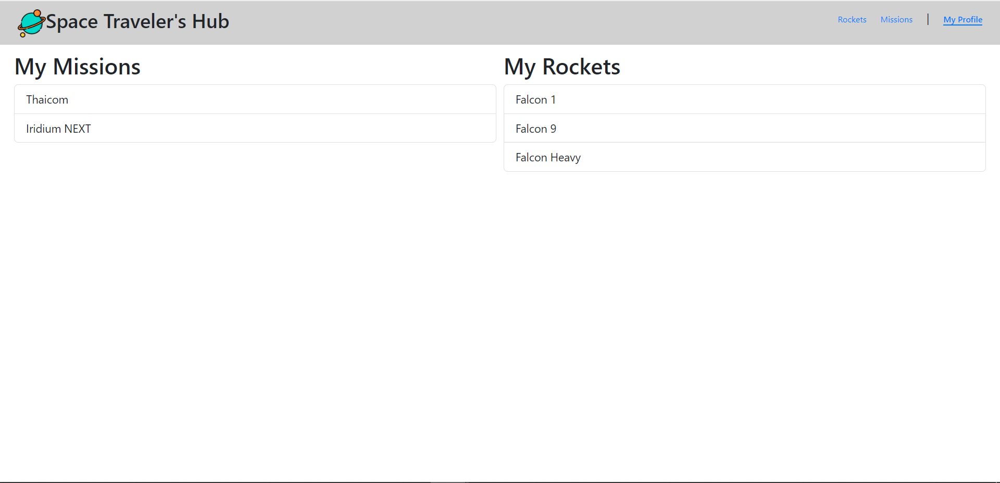

# Space-Travelers-Hub

The Space Travelers is a a React, Redux application based on the SpaceX API.
This app is built with HTML | CSS | JAVASCRIPT | React and Redux and JEST it uses multiple API to render rockets and missions and enable users to have reserve the reocket and also join the mission.

## Built With

- HTML.
- Javascript.
- Css.
- React-Redux.
- Jest.
- React-Bootstrap.

## To get a local copy up and running follow these simple example steps.

- Clone this repo to your machine by using Git clone: Git clone `https://github.com/kendoriddy/Space-Travelers-Hub.git`
- open in your vs code terminal and run live server
- open in your browser
- run `npm i react-app` to install all the dependencies
- run `npm start` to start the server
- run `npm test` to run the test
- run `npm run build` to build the project

### Run the following tests:

To run tests on this project if you tweaked something, run the following command

- `npx hint .`
- `npx stylelint "\*_/_.{css,scss}"`
- `npx eslint .`
- Install jest using `npm i --save-dev jest`
- Install jsDom using `npm install --save-dev jest-environment-jsdom-global jest-environment-jsdom`
- run your test using `npm run test`

### LIVE DEMO

Check the live demo here [Marvel Space](https://marvel-space.netlify.app/)

## Authors

👤 **Kehinde Onifade**

- GitHub: [@githubhandle](https://github.com/kendoriddy)
- Twitter: [@twitterhandle](https://twitter.com/rideonone09)
- LinkedIn: [LinkedIn](https://www.linkedin.com/in/kehindeonifade)

👤 **Sami Ullah**

- GitHub: [@githubhandle](https://github.com/samiullah997)
- Twitter: [@twitterhandle](https://twitter.com/samiullahk997)
- LinkedIn: [LinkedIn](https://www.linkedin.com/in/samiullah-khan-2702b7171/)

## 🤝 Contributing

Contributions, issues, and feature requests are welcome!

Feel free to check the [issues page](https://github.com/kendoriddy/Space-Travelers-Hub/issues).

## Show your support

Give a ⭐️ if you like this project!

## Acknowledgments

- Hat tip to anyone whose code was used
- Inspiration
- etc

## 📝 License

This project is licensed by [MIT](./LICENSE).
